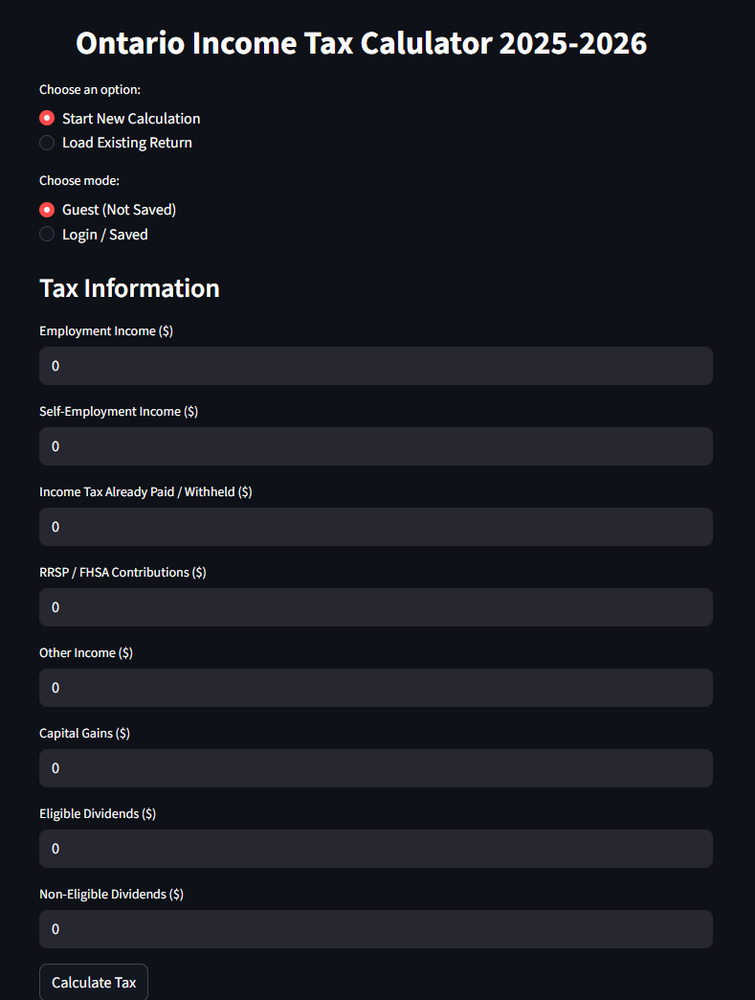

This project is a Python-based Canadian income tax estimator that calculates Federal and Ontario income taxes based on user-provided financial information.

In addition to calculation, the project includes a simple return-saving and retrieval system. Each saved return is assigned a unique randomly generated Tax Reference ID.

